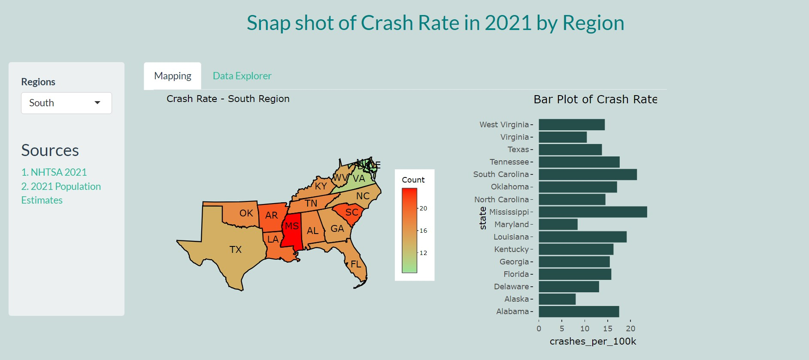

# <h2 align = "center">Crash Rate By State in 2021</h2>
 
<h3 align="center"> Hi there 👋</h3>

I'm Victoria Kwamboka, a self-motivated Statistician.

I created this repository as part of my assignment to showcase exploratory skills as well as analytical and statistical techniques. Fun right?

This repository contains code about the crash rate in 2021 by state using data from [NHTSA](https://www.nhtsa.gov/file-downloads?p=nhtsa/downloads/FARS/2021/National/) - National Highway Traffic Safety Adminstration.

Feel free to play around with the functionalities of the website. I will really appreciate any feedback on the same for future improvement.

## 👉 Link to App
https://victoriakwamboka.shinyapps.io/nhtsa22/

## 👉 First Glance

